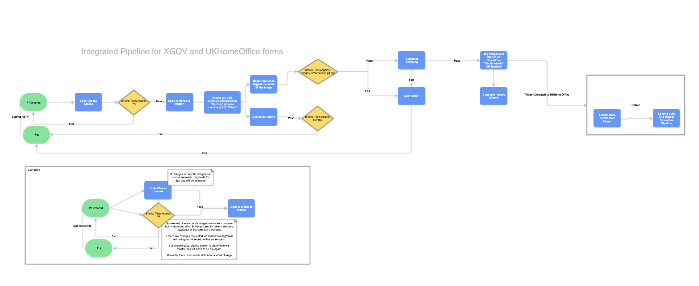

# Digital-form-builder ACP pipeline

Repo for building the ACP Images for Digital-Form-Builder

## High level overview

The diagram below gives a high level overview of the pipelines for the [XGovFormBuilder/digital-form-builder](https://github.com/XGovFormBuilder/digital-form-builder) for ACP

## Inner workings

When a new image is published in the [XGovFormBuilder/digital-form-builder](https://github.com/XGovFormBuilder/digital-form-builder), it triggers and dispatch action. This is listened to by .github/workflows/remote-dispatch-listener.yml

This action then tags this repo with the same tag as and commits the meta-data in the .env file

There on the metadata in .env is used to for extending and building the docker images for ACP.

This pipeline deploys the images in ECR and triggers the dev deployment via [digital-form-builder-acp-deploy](https://github.com/UKHomeOffice/digital-form-builder-acp-deploy)

